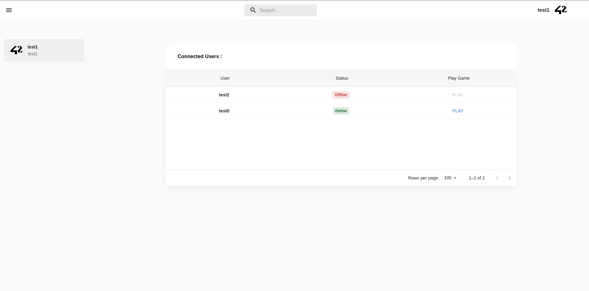
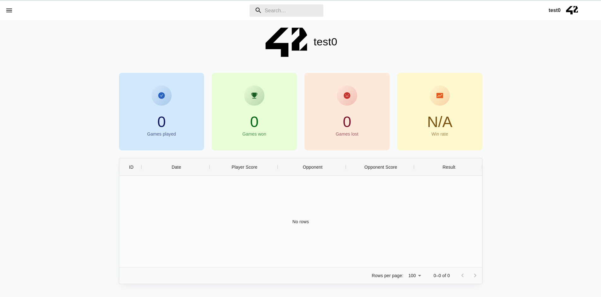
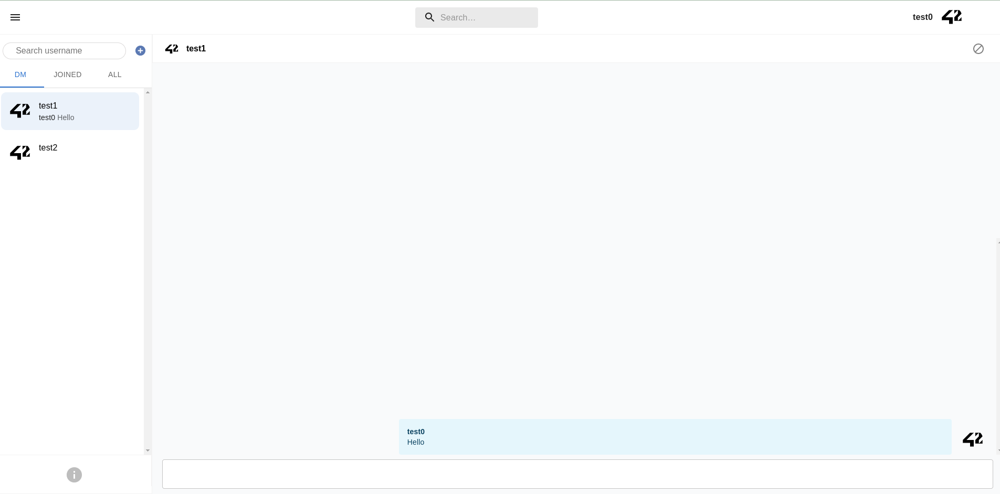

# ft_transcendence

| Project Name | ft_transcendence |
| :-: | :-: |
| Description | A full-stack infrastructure for an online multiplayer game. |
| Technologies |      |
| Final grade | 100/100 |

## Usage

For the purpose of the tests, we created manually 3 users.
We also created fake environment files.

```
git clone https://github.com/robinbnc/ft_transcendence.git
```
```
make
```
http://127.0.0.1:3001

## Images




